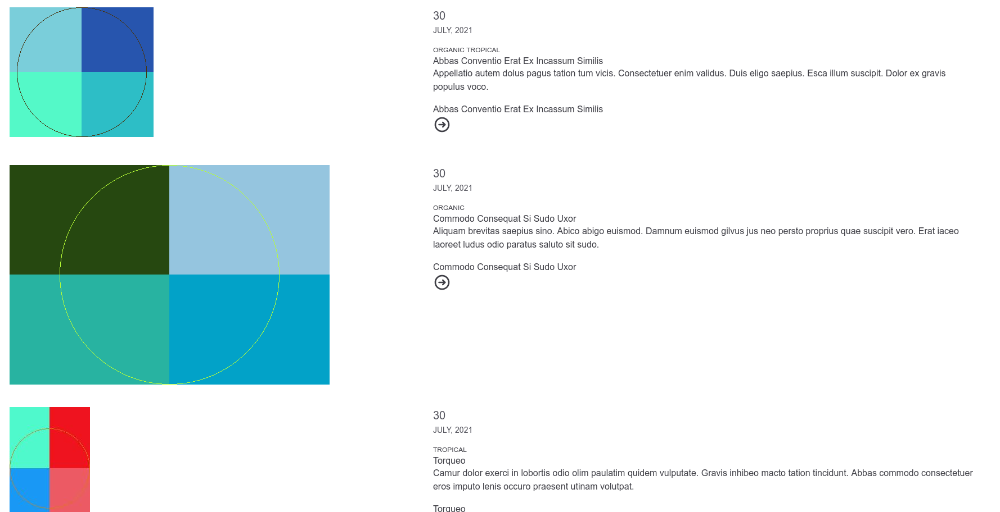

# Component library demo
Demo the features of Drupal's [component library](http://www.drupal.org/component_library)
with [tailwind](https://tailwindcss.com/).

## Used modules:
- [drupal/component_library](http://www.drupal.org/component_library)
- [drupal/component_blocks](http://www.drupal.org/component_blocks)
- [drupal/ui_patterns](http://www.drupal.org/ui_patterns)
- [drupal/token](http://www.drupal.org/token)

## To get started / TLDR;
- Install/setup [ddev](https://ddev.readthedocs.io)
- `ddev start`
- `ddev ssh`
- `composer install`
- `composer si`
- `drush genc --bundles=article 10 0`
- `cd web/themes/custom/tw_theme`
- `yarn install`
- `yarn build-dev`
- `drush uli`

Open the website and see article teasers that are styled using component library

## Beyond the basics

- To build your own components and variations, add them at `/admin/structure/component-library-pattern`
- Then map them to a view mode using layout builder and `component_blocks`.

## Screenshot

